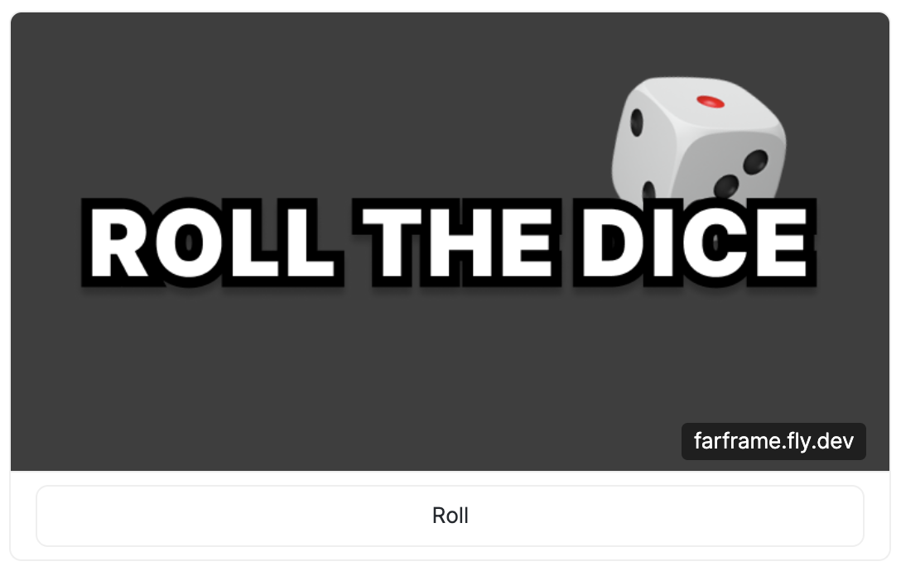

# FarFrame

My attempt at building a Farcaster Frame. Less than 100 LOC.



## Made using Elysia.js

```Typescript
const app = new Elysia()
  .use(staticPlugin())
  .use(html())
  .get(
    "/",
    () => `
    <!DOCTYPE html>
    <html lang="en">
      <head>
        <meta charset="UTF-8">
        <meta name="viewport" content="width=device-width, initial-scale=1.0">
        <title>FarFrame</title>
        <meta property="og:title" content="Frame" />
        <meta property="og:image" content="${BASE_URL}/public/initial.png" />
        <meta property="fc:frame" content="vNext" />
        <meta property="fc:frame:image" content="${BASE_URL}/public/initial.png" />
        <meta property="fc:frame:button:1" content="Roll" />
        <meta property="fc:frame:post_url" content="${BASE_URL}/api/frame" />
      </head>
      <body>
        <h1>FarFrame</h1>
      </body>
    </html>`
  )
  .post("/api/frame", async ({ request }) => {
    try {
      await request.json();
    } catch (error) {
      return new Response(
        JSON.stringify({ error: "Invalid JSON in request body" }),
        {
          status: 400,
          headers: { "Content-Type": "application/json" },
        }
      );
    }

    return new Response(
      `<!DOCTYPE html>
        <html lang="en">
        <head>
          <meta property="fc:frame" content="vNext" />
          <meta property="fc:frame:image" content="${BASE_URL}/public/roll.png" />
          <meta property="fc:frame:post_url" content="${BASE_URL}/api/frame" />
        </head>
        </html>`,
      {
        status: 200,
        headers: { "Content-Type": "text/html" },
      }
    );
  })
  .listen(PORT!);
```

### Inspirations

- [gskril](https://github.com/gskril)'s [farcast-frame](https://github.com/gskril/farcaster-frame)
- [Zizzamia](https://github.com/Zizzamia)'s [a-frame-in-100-lines](https://github.com/Zizzamia/a-frame-in-100-lines)
